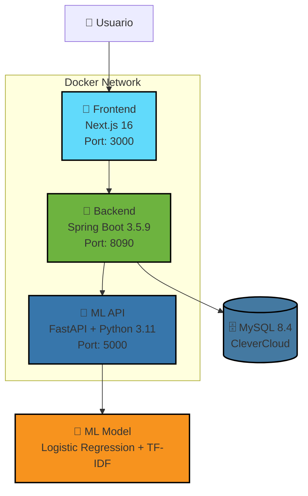

# 🎭 Sentiment Analysis API - Full Stack Application

<div align="center">


**Una aplicación completa de análisis de sentimientos con Machine Learning, API REST y una interfaz web moderna.**

[🚀 Quick Start](#-quick-start) • [📚 Documentación](#-documentación) • [🏗️ Arquitectura](#️-arquitectura) • [🤝 Contribuir](#-contribuir)

</div>

---

## 📖 Descripción

Sistema de análisis de sentimientos que clasifica textos en **positivo**, **negativo** o **neutral** utilizando Machine Learning. El proyecto incluye:

- 🤖 **Modelo de ML** entrenado con Logistic Regression y TF-IDF
- 🔧 **API REST** robusta con Spring Boot y autenticación JWT
- 🎨 **Interfaz web** moderna con Next.js y TypeScript
- 📊 **Estadísticas** y análisis en tiempo real
- 📤 **Carga masiva** de datos mediante archivos CSV
- 🐳 **Despliegue simple** con Docker Compose

---

## 🛠️ Stack Tecnológico

### Backend


- **Spring Security** con JWT y BCrypt
- **Flyway** para migraciones de base de datos
- **Hibernate** JPA para ORM
- **Tomcat** 10.1.50 embedded

### Frontend


- **pnpm** para gestión de dependencias
- **Server-Side Rendering** (SSR)
- Diseño responsive y moderno

### Machine Learning


- **Uvicorn** como servidor ASGI
- **TF-IDF Vectorizer** para procesamiento de texto
- **Logistic Regression** para clasificación
- Preprocesamiento de texto en español

### DevOps


---

## 🏗️ Arquitectura



### Flujo de Datos

1. 👤 Usuario interactúa con la interfaz web (Next.js)
2. 🎨 Frontend envía peticiones al Backend con autenticación JWT
3. 🔧 Backend valida, procesa y envía texto a la API de Python
4. 🐍 API Python analiza el sentimiento con el modelo de ML
5. 📊 Backend almacena resultados en MySQL y retorna al Frontend
6. 🎯 Usuario visualiza resultados y estadísticas

---

## 🚀 Quick Start

### Prerrequisitos

- [Docker Desktop](https://www.docker.com/products/docker-desktop/) instalado y corriendo
- Git para clonar el repositorio

### Instalación Rápida

```bash
# 1. Clonar el repositorio
git clone <URL_DEL_REPOSITORIO>
cd sentiment-api-docker

# 2. Levantar todos los servicios con Docker
docker-compose up --build

# 3. Esperar a que todos los servicios inicien (~2-5 minutos)
# Verás: ✅ sentiment-api-python | Uvicorn running...
#        ✅ sentiment-backend | Started SentimentApiApplication...
#        ✅ sentiment-frontend | ✓ Ready in Xms

# 4. Abrir en el navegador
# http://localhost:3000
```

### Credenciales de Acceso

- **Email**: `user@gmail.com`
- **Contraseña**: `12345`

> ⚠️ **IMPORTANTE**: Las credenciales de base de datos y secretos JWT deben configurarse mediante variables de entorno. 
> Ver [Configuración de Variables de Entorno](#️-configuración-de-variables-de-entorno) para más detalles.

### URLs de los Servicios

| Servicio | URL | Descripción |
|----------|-----|-------------|
| 🎨 Frontend | http://localhost:3000 | Interfaz web principal |
| 🔧 Backend API | http://localhost:8090 | API REST (requiere JWT) |
| 🐍 Python API | http://localhost:5000/docs | Documentación interactiva de FastAPI |

---

## 📚 Documentación

### 📘 Guía de Uso Detallada

Consulta [DOCKER-README.md](./DOCKER-README.md) para:
- Instrucciones paso a paso
- Solución de problemas comunes
- Comandos útiles de Docker
- Configuración avanzada

### 📁 Estructura del Proyecto

```
sentiment-api-docker/
├── 📁 back_sentimenAPI_Hakaton/    # Backend Spring Boot
│   ├── src/
│   │   └── main/
│   │       ├── java/               # Código Java
│   │       └── resources/          # application.properties
│   ├── Dockerfile                  # Multi-stage build con Maven
│   └── pom.xml
│
├── 📁 API-dataScience/             # API Python ML
│   ├── app.py                      # FastAPI app
│   ├── nlp_utils.py                # Utilidades de NLP
│   ├── model/                      # Modelos entrenados
│   │   ├── modelo.joblib
│   │   └── vectorizador.joblib
│   ├── requirements.txt
│   └── Dockerfile
│
├── 📁 fron-sentiment-api/          # Frontend Next.js
│   ├── app/                        # App Router
│   │   ├── dashboard/              # Páginas del dashboard
│   │   ├── login/                  # Página de login
│   │   └── actions/                # Server Actions
│   ├── next.config.ts
│   ├── package.json
│   └── Dockerfile
│
├── docker-compose.yml              # Orquestación de servicios
├── README.md                       # Este archivo
└── DOCKER-README.md                # Guía de Docker
```

---

## 🎯 Funcionalidades

### ✅ Análisis de Sentimientos
- Clasifica textos en **Positivo**, **Negativo** o **Neutral**
- Procesamiento en tiempo real
- Soporte para texto en español
- Análisis individual y masivo

### 📊 Dashboard de Estadísticas
- Visualización de métricas en tiempo real
- Gráficos de distribución de sentimientos
- Historial de análisis
- Exportación de datos

### 📤 Carga Masiva (CSV)
- Importación de archivos CSV
- Procesamiento por lotes
- Validación de formato
- Descarga de resultados

### 🔐 Autenticación y Seguridad
- Sistema de login con JWT
- Contraseñas hasheadas con BCrypt
- Protección de rutas
- Sesiones seguras

---

## 🔧 Desarrollo Local (Sin Docker)

<details>
<summary><b>Mostrar instrucciones</b></summary>

### Backend (Spring Boot)

```bash
cd back_sentimenAPI_Hakaton

# Configurar perfil local
export SPRING_PROFILES_ACTIVE=local  # Linux/Mac
$env:SPRING_PROFILES_ACTIVE="local"  # Windows PowerShell

# Ejecutar
./mvnw spring-boot:run
```

### API Python

```bash
cd API-dataScience

# Crear entorno virtual
python -m venv venv
source venv/bin/activate  # Linux/Mac
venv\Scripts\activate     # Windows

# Instalar dependencias
pip install -r requirements.txt

# Ejecutar
python -m uvicorn app:app --host 0.0.0.0 --port 5000
```

### Frontend

```bash
cd fron-sentiment-api

# Instalar dependencias
pnpm install

# Ejecutar en desarrollo
pnpm dev
```

</details>

---

## ⚙️ Configuración de Variables de Entorno

### 🔐 Seguridad de Credenciales

**⚠️ NUNCA subas archivos `.env` o archivos con credenciales reales a GitHub.**

### Configuración Local

1. **Backend**: Copia el archivo de ejemplo
   ```bash
   cd back_sentimenAPI_Hakaton
   cp .env.example .env
   # Edita .env con tus credenciales
   ```

2. **Frontend**: Copia el archivo de ejemplo
   ```bash
   cd fron-sentiment-api
   cp .env.example .env.local
   # Edita .env.local con la URL del backend
   ```

3. **Docker Compose**: Las credenciales están en `docker-compose.yml`
   - Para producción, usa variables de entorno del sistema
   - O crea un archivo `.env` en la raíz (Git lo ignorará)

### Variables Requeridas

#### Backend
- `SPRING_DATASOURCE_URL`: URL de conexión a MySQL
- `SPRING_DATASOURCE_USERNAME`: Usuario de la base de datos
- `SPRING_DATASOURCE_PASSWORD`: Contraseña de la base de datos
- `PALABRA_SECRETA_JWT`: Secreto para firmar tokens JWT

#### Frontend
- `NEXT_PUBLIC_API_URL`: URL del backend (para el navegador)
- `API_URL`: URL del backend (para server-side)

---

## 🧪 Testing

```bash
# Backend - Tests con JUnit
cd back_sentimenAPI_Hakaton
./mvnw test

# Frontend - Tests con Jest
cd fron-sentiment-api
pnpm test

# Python - Tests con pytest
cd API-dataScience
pytest
```

---

## 📊 Endpoints Principales

### Backend API (Port 8090)

| Método | Endpoint | Descripción | Autenticación |
|--------|----------|-------------|---------------|
| POST | `/login` | Autenticación de usuario | ❌ No |
| POST | `/sentiment` | Analizar sentimiento de texto | ✅ JWT |
| POST | `/sentiment/upload-csv` | Carga masiva de textos | ✅ JWT |
| GET | `/stats?size={n}` | Obtener estadísticas | ✅ JWT |

### Python ML API (Port 5000)

| Método | Endpoint | Descripción |
|--------|----------|-------------|
| POST | `/predict` | Predicción de sentimiento |
| GET | `/docs` | Documentación interactiva |

---

## 🐳 Comandos Docker Útiles

```bash
# Iniciar servicios
docker-compose up -d

# Ver logs
docker-compose logs -f

# Reiniciar un servicio
docker-compose restart sentiment-backend

# Reconstruir imágenes
docker-compose build --no-cache

# Detener y limpiar
docker-compose down -v

# Ver uso de recursos
docker stats
```

---

## 🌍 Despliegue en Producción

El proyecto está preparado para despliegue en:

- **Frontend**: Vercel / Netlify
- **Backend**: Azure Web Apps / AWS ECS
- **Python API**: Hugging Face Spaces / Heroku
- **Base de datos**: CleverCloud MySQL (configurado)

---

## 🤝 Contribuir

¡Las contribuciones son bienvenidas! 

1. Fork el proyecto
2. Crea una rama para tu feature (`git checkout -b feature/AmazingFeature`)
3. Commit tus cambios (`git commit -m 'Add: AmazingFeature'`)
4. Push a la rama (`git push origin feature/AmazingFeature`)
5. Abre un Pull Request

---

## 📝 Licencia

Este proyecto está bajo la Licencia MIT. Ver el archivo `LICENSE` para más detalles.

---

## 🙏 Agradecimientos

- Scikit-learn por las herramientas de ML
- Spring Boot por el framework robusto
- Next.js por la increíble experiencia de desarrollo
- CleverCloud por el hosting de la base de datos

---

## 📧 Contacto

¿Preguntas o sugerencias? Abre un issue o contacta al equipo.

<div align="center">

**⭐ Si te gustó el proyecto, dale una estrella en GitHub ⭐**

Made with ❤️ by the Sentiment Analysis Team

</div> 